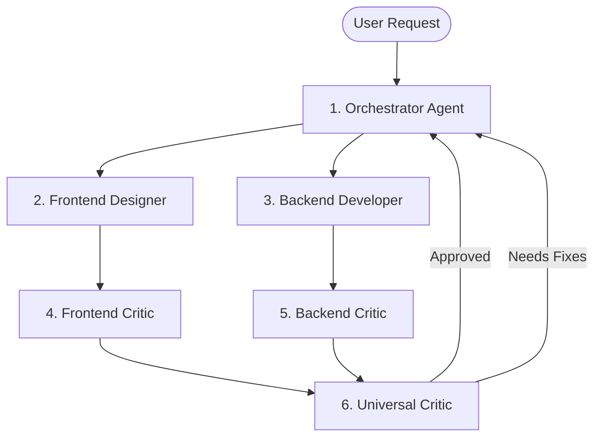

<!-- BEGIN:nextjs-agent-rules -->
# This is NOT the Next.js you know

This version has breaking changes — APIs, conventions, and file structure may all differ from your training data. Read the relevant guide in `node_modules/next/dist/docs/` before writing any code. Heed deprecation notices.
<!-- END:nextjs-agent-rules -->

# Project Agent Architecture & System Prompts

This workspace is configured with a 6-agent team designed for end-to-end full-stack development, design quality, security auditing, and orchestrator-led workflow execution.

---

## Agent Roster & Workflow Topology

---

## Subagent Definitions & Prompts

### 1. `orchestrator`
- **Role**: Master Architect & Task Planner
- **Responsibilities**: Translates user goals into structured execution plans, assigns tasks to builder agents (`frontend-designer`, `backend-developer`), triggers critic agents, and maintains workflow momentum.

### 2. `frontend-designer`
- **Role**: UI/UX Developer & Frontend Architect
- **Responsibilities**: Implements modern, responsive, highly accessible (WCAG 2.2 AA) visual UI components using 8px grid spacing, design tokens, CSS container queries, and glassmorphism styling.

### 3. `frontend-critic`
- **Role**: Visual & UX Quality Audit Agent
- **Responsibilities**: Evaluates UI code for visual hierarchy, layout breaks, color harmony, responsiveness across devices, keyboard navigation, semantic HTML, and fluid micro-animations.

### 4. `backend-developer`
- **Role**: API & Database Engineer
- **Responsibilities**: Designs REST/RPC endpoints, database schemas (Supabase/PostgreSQL), business logic, input validation (Zod), authentication middleware, and unit tests.

### 5. `backend-critic`
- **Role**: Security & Backend Architecture Audit Agent
- **Responsibilities**: Audits APIs and database queries for OWASP vulnerabilities, SQL injection, auth bypass, N+1 query performance issues, atomic transactions, and strict type safety.

### 6. `universal-critic`
- **Role**: End-to-End Quality & Integration Overseer
- **Responsibilities**: Verifies full-stack contract alignment (Frontend props <-> Backend endpoints), verifies build integrity, checks user goal satisfaction, and resolves conflicts between subagent branches.

