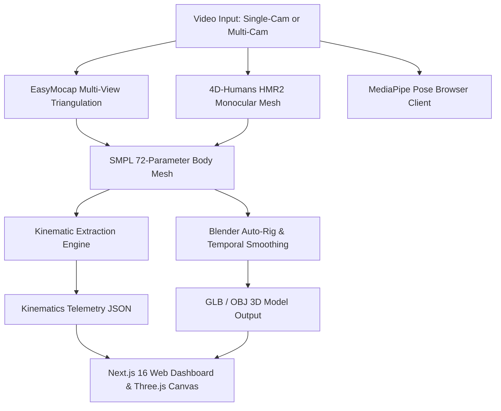

# rvectr 🧬

> **Markerless 3D Human Mesh Recovery & Real-Time Kinematic Telemetry Engine**

`rvectr` reconstructs full 3D human body surface meshes (6,890 SMPL vertices) from consumer-camera video, extracts frame-by-frame joint kinematics, and visualizes real-time joint angular velocity and kinetic curves in an interactive 3D WebGL viewport.

> [!IMPORTANT]
> **Project status (July 2026):** rvectr has pivoted from a SaaS coaching product to an open research program studying **velocity-dependent error in markerless 3D human pose estimation** — benchmarking EasyMocap, 4D-Humans/HMR2, and MediaPipe against synthetic SMPL ground truth. See [`docs/RESEARCH_ROADMAP.md`](docs/RESEARCH_ROADMAP.md) for the research question, methodology, and timeline. The earlier SaaS launch plan is archived in [`docs/archive/`](docs/archive/).

---

## ✨ Core Features

* **Monocular 3D Human Mesh Recovery (HMR2 / 4D-Humans)**: Reconstructs high-density 3D SMPL parametric body meshes directly from single-camera videos.
* **Multi-View 3D Spatial Triangulation (EasyMocap)**: Synchronizes multi-camera recordings to solve single-camera self-occlusions and perform 3D joint triangulation.
* **Real-Time In-Browser Telemetry (MediaPipe + Three.js)**: Runs zero-latency pose estimation and interactive 360° 3D skeleton rendering directly inside web browsers.
* **Kinematics Engine**: Calculates frame-by-frame joint angles (hip depth, knee flexion, spinal alignment), movement phase transitions (eccentric/concentric), and bilateral asymmetries.
* **Dual Viewport & Synchronized Scrubbing**: Synchronizes raw video playback with 3D mesh motion and live waveform telemetric charts.

---

## 🏗️ Architecture Pipeline



---

## 📁 Repository Structure

```
rvectr/
├── src/                          # Next.js 16 viewer (/, /analysis, /demo, /test/squat, /upload)
│   ├── components/biomechanics/  # ThreeMeshCanvas, KinematicWaveformChart, DualViewport
│   └── lib/cv/                   # Kinematic angle calculations & grading logic
├── backend/                      # Python 3D Vision & Kinematics Pipeline
│   ├── README.md                 # ⚠️ READ FIRST — which script to run, and which not to
│   ├── 4D-Humans/                # Monocular 3D Mesh Recovery Submodule (MIT)
│   ├── EasyMocap/                # Multi-view 3D Triangulation Submodule (Non-Commercial)
│   ├── pipeline/                 # Gait events, stride metrics, pelvic analysis
│   ├── tests/                    # 31 tests — run with `pytest tests/`
│   ├── rvectr_paths.py           # Path resolution (env-overridable, no hardcoded paths)
│   ├── extract_kinematics.py     # Frame-by-frame 3D joint telemetry calculation
│   └── run_4d_humans_videos2.py  # Local GPU inference runner
├── docs/
│   ├── RESEARCH_ROADMAP.md       # Current research program & 12-week plan
│   ├── WORKSPACE_SUMMARY.md      # Architecture & CV stack reference
│   ├── osf_preregistration_draft.md
│   ├── log/                      # Dated engineering log
│   ├── writeups/                 # Science exhibition writeups
│   └── archive/                  # Retired SaaS-era planning docs
├── critical_analysis.md          # Standing audit of known defects & their status
└── LICENSE                       # Research / non-commercial (NOT MIT — see below)
```

> [!CAUTION]
> **Not everything in `backend/` measures what its name suggests.**
> `run_easymocap_videos2.py` calibrates cameras and extracts 2D keypoints, then
> **discards them** and emits a hand-authored animation. Its outputs are not
> capture results. Read [`backend/README.md`](backend/README.md) before running
> or citing anything, and [`critical_analysis.md`](critical_analysis.md) for the
> full list of known defects.

---

## 🚀 Quickstart Guide

### 1. Clone the Repository (with Submodules)

```bash
git clone --recursive https://github.com/pd302423/rvectr.git
cd rvectr
```

If you already cloned without submodules, initialize them:
```bash
git submodule update --init --recursive
```

### 2. Run the Web Application

```bash
# Install frontend dependencies
npm install

# Start development server
npm run dev
```

Open [http://localhost:3000](http://localhost:3000) for the viewer. Note that
`/analysis` displays clearly-labelled **sample data** until a real analysis is
loaded — nothing on that page is a measurement.

### 3. Setup Python Backend Pipeline

Three incompatible environments are required (4D-Humans needs Python 3.10,
EasyMocap needs 3.11). Full detail in [`backend/README.md`](backend/README.md).

```bash
cd backend

# Core environment — kinematics, mesh processing, tests. No GPU needed.
python3.11 -m venv .venv-core && source .venv-core/bin/activate
pip install -r requirements-core.txt

pytest tests/    # 31 tests
```

For the deep-learning backends see `requirements-hmr2.txt` (Python 3.10) and
`setup_env.sh` (EasyMocap).

---

## 📄 License & Attributions

> [!WARNING]
> **Research and non-commercial use only. This project is NOT MIT-licensed.**
>
> rvectr builds on **EasyMocap**, which permits educational, research, and non-profit use only, requires that modifications remain open-source, and prohibits commercial use. Those terms govern this entire repository. See [`LICENSE`](LICENSE) for the full text and the complete attribution list.

| Component | Terms |
|---|---|
| **[EasyMocap](https://github.com/zju3dv/EasyMocap)** | Non-commercial, research/education only — **most restrictive; governs this project** |
| **[4D-Humans / HMR2](https://github.com/shubham-goel/4D-Humans)** | MIT — © 2023 UC Regents, Shubham Goel |
| **[SMPL / SMPL-X](https://smpl.is.tue.mpg.de)** | Separate MPI model license — **not redistributed here**; obtain and accept separately |
| **[MediaPipe](https://github.com/google-ai-edge/mediapipe)** | Apache 2.0 — © Google LLC |

## ⚠️ Not a medical device

This is a research prototype. It is **not** a medical or diagnostic device, and its accuracy has **not been validated against any reference standard**. No accuracy claim is made. Do not use it to inform medical, rehabilitative, or training decisions where inaccuracy could cause harm.
