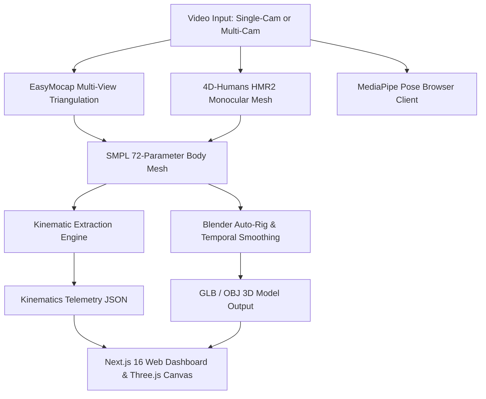

# rvectr 🧬

> **Markerless 3D Human Mesh Recovery & Real-Time Kinematic Telemetry Engine**

`rvectr` is a clinical-grade biomechanical precision coaching system for athletic performance, physical rehabilitation, and calisthenics. It reconstructs full 3D human body surface meshes (6,890 SMPL vertices), diagnoses form breakdowns against sports science standards, and visualizes real-time joint angular velocity and kinetic curves in an interactive 3D WebGL viewport.

---

## ✨ Core Features

* **Monocular 3D Human Mesh Recovery (HMR2 / 4D-Humans)**: Reconstructs high-density 3D SMPL parametric body meshes directly from single-camera videos.
* **Multi-View 3D Spatial Triangulation (EasyMocap)**: Synchronizes multi-camera recordings to solve single-camera self-occlusions and perform 3D joint triangulation.
* **Real-Time In-Browser Telemetry (MediaPipe + Three.js)**: Runs zero-latency pose estimation and interactive 360° 3D skeleton rendering directly inside web browsers.
* **Clinical Kinematics Engine**: Calculates frame-by-frame joint angles (hip depth, knee flexion, spinal alignment), movement phase transitions (eccentric/concentric), and bilateral asymmetries.
* **Dual Viewport & Synchronized Scrubbing**: Synchronizes raw video playback with 3D mesh motion and live waveform telemetric charts.

---

## 🏗️ Architecture Pipeline



---

## 📁 Repository Structure

```
rvectr/
├── src/                          # Next.js 16 Web Application
│   ├── app/                      # App Router pages (/dashboard, /analysis, /test/squat)
│   ├── components/biomechanics/  # ThreeMeshCanvas, KinematicWaveformChart, DualViewport
│   └── lib/cv/                   # Kinematic angle calculations & grading logic
├── backend/                      # Python 3D Vision & Kinematics Pipeline
│   ├── 4D-Humans/                # Monocular 3D Mesh Recovery Submodule (MIT)
│   ├── EasyMocap/                # Multi-view 3D Triangulation Submodule (Non-Commercial)
│   ├── pipeline/                 # Kinematic extraction, pelvic & gait mechanics
│   ├── extract_kinematics.py     # Frame-by-frame 3D joint telemetry calculation
│   └── run_4d_humans_videos2.py  # Local GPU inference runner
├── WORKSPACE_SUMMARY.md          # Full clinical & architectural documentation
└── README.md                     # Overview & Quickstart Guide
```

---

## 🚀 Quickstart Guide

### 1. Clone the Repository (with Submodules)

```bash
git clone --recursive https://github.com/pd302423/rvectr.git
cd rvectr
```

If you already cloned without submodules, initialize them:
```bash
git submodule update --init --recursive
```

### 2. Run the Web Application

```bash
# Install frontend dependencies
npm install

# Start development server
npm run dev
```

Open [http://localhost:3000](http://localhost:3000) to access the interactive biomechanics dashboard.

### 3. Setup Python Backend Pipeline

```bash
cd backend

# Create & activate Python virtual environment
python3 -m venv venv
source venv/bin/activate

# Install requirements
pip install -r 4D-Humans/requirements.txt
```

---

## 📄 License & Attributions

This project is licensed under the **MIT License**.

### Third-Party Submodules & Attributions
* **[4D-Humans](https://github.com/shubham-goel/4D-Humans)**: MIT License — Copyright (c) 2023 UC Regents, Shubham Goel.
* **[EasyMocap](https://github.com/zju3dv/EasyMocap)**: Open-Source Non-Commercial License — Copyright (c) 2020-2021 3D Vision Group, CAD&CG, Zhejiang University.
