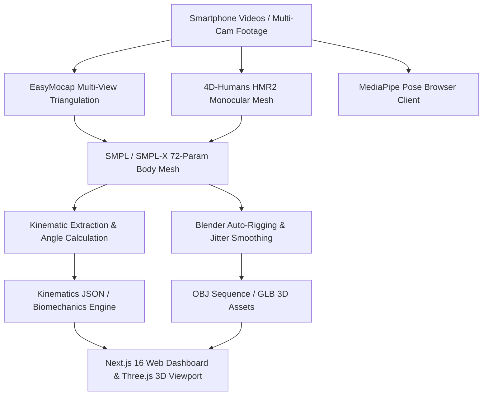

# rvector — Workspace Architecture & Computer Vision Stack Summary

> [!NOTE]
> **rvector** is a clinical biomechanical precision coaching system for calisthenics & athletic performance. It measures rep execution, diagnoses form breakdowns against peer-reviewed sports science standards, and renders 3D human body meshes and telemetry curves in real time.

---

## 1. Executive Summary & Product Vision

| Parameter | Details |
|---|---|
| **Core Product** | Biomechanical Precision Coaching System ("The Qoves of Calisthenics") |
| **Primary Moat** | Monocular & Multi-view 3D Body Mesh Recovery + Clinical Kinematic Telemetry |
| **Target Hardware** | Local NVIDIA RTX 5060 GPU (Inference & Training) + Consumer Smartphones |
| **Web Tech Stack** | Next.js 16 (App Router), TypeScript, Tailwind CSS, Supabase, Three.js / WebGL |
| **Core Reference Docs** | [HANDOFF.md](file:///home/pd/Documents/rvector/HANDOFF.md), [ROADMAP.md](file:///home/pd/Documents/rvector/ROADMAP.md), [AGENTS.md](file:///home/pd/Documents/rvector/AGENTS.md) |

---

## 2. 3D Vision & Motion Capture Architecture

### A. Repositories & Engine Frameworks
1. **EasyMocap** ([run_easymocap_videos2.py](file:///home/pd/Documents/rvector/backend/run_easymocap_videos2.py))
   - **Multi-View 3D Motion Capture**: Processes multi-camera synchronized recordings (e.g., Nothing Phone CE 3 & OnePlus Nord camera views in `videos2/`).
   - Calibrates camera intrinsics & extrinsics using chessboard calibration patterns.
   - Performs 3D spatial keypoint triangulation and SMPL joint fitting, solving single-camera self-occlusion issues.
2. **4D-Humans / HMR2** ([run_4d_humans_videos2.py](file:///home/pd/Documents/rvector/backend/run_4d_humans_videos2.py))
   - **Monocular 3D Human Mesh Recovery**: Fits a 6,890-vertex SMPL body surface mesh directly from single-view video clips.
   - Runs locally on GPU (PyTorch, ViTDet detector, HMR2 network).
3. **MediaPipe Pose (`@mediapipe/tasks-vision`)**
   - Client-side 2D/3D pose estimation running in requestAnimationFrame loops for instant live feedback (e.g., `/test/squat` telemetry route).

### B. SMPL / SMPL-X Body Models & Asset Formats
- **SMPL Parametric Mesh**: 6,890 vertices, 72 structural joint rotation parameters.
- **Blender & Mesh Automation**:
  - [zero_drift_perfect_smpl_builder.py](file:///home/pd/Documents/rvector/backend/zero_drift_perfect_smpl_builder.py): Applies Gaussian temporal filtering to remove joint jitter and anchors stationary root positions during static exercises.
  - Generates `.obj` frame sequences (`videos2/obj_sequence/`), `.blend` project files (`squat_multiview_animated.blend`), `.glb` web models (`squat_3d_mesh.glb`), and numpy matrices (`squat_vertices_anim.npy`).

---

## 3. Kinematics & Biomechanics Pipeline

Located in `backend/` and `backend/pipeline/`:
- **Kinematic Extraction** ([extract_kinematics.py](file:///home/pd/Documents/rvector/backend/extract_kinematics.py)): Computes frame-by-frame 3D joint angles (hip depth, knee flexion, elbow angle, spinal posture).
- **Movement Analysis** (`gait_events.py`, `pelvic_analysis.py`, `stride_metrics.py`): Performs phase detection (eccentric vs. concentric phases), pelvic tilt analysis, and bilateral symmetry metrics.

---

## 4. Web Application & Telemetry Components

The web application is located under `src/` (and root web workspace):

### Key Routes
- `/dashboard` — Main athlete dashboard
- `/analysis` — Biomechanical lab report with dual viewport & waveform charts
- `/test/squat` — Real-time MediaPipe squat telemetry testing route
- `/upload` — Video ingestion pipeline
- `/onboarding` & `/signin` — User auth and profiling

### Biomechanical Visualizer Components
- [ThreeMeshCanvas.tsx](file:///home/pd/Documents/rvector/src/components/biomechanics/ThreeMeshCanvas.tsx): 360° interactive 3D WebGL skeleton and SMPL mesh canvas built with Three.js.
- [KinematicWaveformChart.tsx](file:///home/pd/Documents/rvector/src/components/biomechanics/KinematicWaveformChart.tsx): Real-time angular velocity and joint motion curves.
- [BilateralAsymmetryMatrix.tsx](file:///home/pd/Documents/rvector/src/components/biomechanics/BilateralAsymmetryMatrix.tsx): Left vs. right joint imbalance breakdown.
- [DualViewport.tsx](file:///home/pd/Documents/rvector/src/components/biomechanics/DualViewport.tsx): Side-by-side synchronized view comparing raw video with the 3D mesh model.

---

## 5. Multi-Agent Development Architecture

Configured in [AGENTS.md](file:///home/pd/Documents/rvector/AGENTS.md) with a 6-agent system topology:
1. `orchestrator` — Task planner and master architect
2. `frontend-designer` — UI/UX & Tailwind styling
3. `frontend-critic` — Visual hierarchy & accessibility auditor
4. `backend-developer` — API, database, and inference engineer
5. `backend-critic` — Security, SQL injection, & performance auditor
6. `universal-critic` — End-to-end full-stack integration overseer
