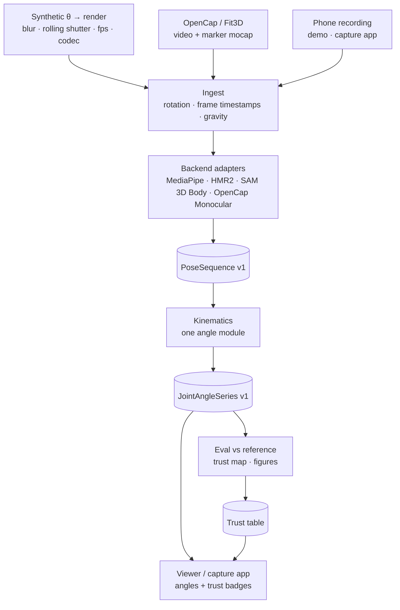

# rvectr — Implementation Roadmap

**Written:** 2026-09-29 · **Status:** plan only — nothing in this document is implemented yet
**Scope:** (1) the research question — *where does consumer-hardware motion capture stop being trustworthy, per exercise?*; (2) a live demo — record someone, get a 3D model and an analysis; (3) a capture setup simple enough for other people to use.
**Relationship to other docs:** builds on [`RESEARCH_ROADMAP.md`](RESEARCH_ROADMAP.md) (research question, relocation context, portfolio plan — all still valid). It replaces that document's "no web app, no server" stance, which a capture app for other people makes untenable. Every finding in §1 was checked against source code on 2026-09-29. Where this document contradicts [`critical_analysis.md`](../critical_analysis.md), this one is newer.

> [!NOTE]
> **IRIS 2026–27 is skipped (decided 2026-09-29).** The fee (about ₹6,000) pays for screening only, with no guaranteed presentation. JSEC is now the only remaining route to ISEF; see §0.

## Summary

1. **No competition deadline for now.** IRIS 2026–27 is skipped. JSEC is the remaining route to ISEF, and whether you're eligible is unconfirmed, so ask JSEC now. See §0.
2. **Recordings from other people can't measure accuracy.** Accuracy needs a reference. Crowd data can measure *reliability* and *robustness*, which also matter for trust, but they are different claims. See §3.5.
3. **Average phone-mocap accuracy is already published.** With a biomechanically constrained pipeline it is about 4.5–4.8° MAE. In a 2025 study, off-the-shelf monocular estimators gave 14–26° on knee angles. What remains open, and what you can own, is *under which conditions* a reading can be trusted, and how a user would know at runtime. See §3.1–3.3.
4. **Measurement defects come first.** Several defects in the current pipeline are larger than the 5° threshold the study tests against. Collecting data before fixing them wastes the data. See §1.2.
5. **The study and the demo share one code path.** The demo should display the study's error bars live, never an angle the study didn't evaluate. See §2.

---

## 0. Competition timing after skipping IRIS

**Decision (2026-09-29): IRIS 2026–27 is skipped.** Search results from the official site list the window as closing 3 Oct 2026. The fee is ₹5,000 + tax (about ₹6,000) and pays for screening only, with no guaranteed presentation. Four days from a standing start would have produced a synthetic-only entry. Because IRIS requires enrolment at a school in India, this was the only possible IRIS cycle, so the India → ISEF route is now closed.

Nothing has been pushed since 26 Jul (`main` and this branch were both at `8626ce6` on 29 Sep). If you have unpushed harness work locally, commit it; Phases 1–2 shrink accordingly.

What the decision changes:

- **JSEC is the remaining ISEF route.** Whether a foreign student enrolled in Japan is eligible is still undocumented (`RESEARCH_ROADMAP.md`). Ask JSEC now rather than after relocating, because the answer decides whether this project has any fair deadline at all.
- **ISEF judges only research inside a 12-month window.** For ISEF 2027 the window begins no earlier than January 2026 ([rules](https://www.societyforscience.org/isef/international-rules/rules-for-all-projects/)). By the same pattern, ISEF 2028, the cycle JSEC 2027 would feed, likely begins January 2027; confirm this in the 2027–28 rules. Work from 2026 would then be prior research in a continuation project (Form 7), and only a substantive expansion would be judged. The phases already split that way, so nothing needs delaying:
  - Phases 1–3 (2026) build the tools and the first squat result.
  - Phases 4–5 (2027: new exercise classes, crowd reliability) are the expansion.
- **The ethics rules still apply.** JSEC follows ISEF's human-participant rules, and consent and privacy law cover recording other people whether or not a fair is involved (§5.3, §6).
- **The portfolio doesn't depend on IRIS.** None of the ten items in `RESEARCH_ROADMAP.md` Part 2 requires a fair result.
- **Relocation (mid-2027 per `RESEARCH_ROADMAP.md`) is the last hard date.** It bounds the Phase 4 pilot, which needs participants and approval from your current school in India, not the research itself.

---

## 1. What the repository actually does (verified 2026-09-29)

### 1.1 Capability audit

| Capability | Claimed in README / docs | Actual state |
|---|---|---|
| Monocular SMPL recovery (HMR2) | Working | **Real**, but affected by defects M2–M5 and M11. |
| Multi-view triangulation | "Multi-View 3D Spatial Triangulation (EasyMocap)" | **Not performed anywhere in rvectr's own code.** Three scripts claim to triangulate and none does, and no script invokes EasyMocap's own triangulation. Searching `backend/*.py` for `triangulatePoints`, `svd`, `solvePnP`, `stereoCalibrate`, projection matrices and EasyMocap's `mv1p` / `apps/demo` entry points finds nothing (M7). |
| Kinematics extraction | Working | **Real**, but affected by convention bugs M5 and M6. |
| Live in-browser pose (`/test/squat`) | "zero-latency" | **Runs, but angles read +8° to +24° high** on typical squat knee angles (M1). |
| 3D viewer | Plays captured mesh | Defaults to `squat_multiview_animated.glb`, which only the authored sine-wave generator produces (critical_analysis finding 0). Frame count and duration are hardcoded to 291 frames and 9.7 s (`ThreeMeshCanvas.tsx:224`). The companion OBJ, `.blend` and `.npy` assets have unknowable provenance (M12). |
| Upload → analysis | — | No backend exists, and the page fails loudly, which is the correct behaviour. |
| `squat_kinematics.json` (161 frames) | Real | Plausibly genuine HMR2 output, but provenance is unverified. Femur length varies from 0.355 to 0.392 m within one clip, which indicates per-frame shape instability (M4). |
| `running_kinematics.json` (90 frames) | "real per-frame joint data" (`critical_analysis.md:247`) | **Procedurally generated** (see below). |
| Tests | "31 tests pass" | On a clean clone: **30 pass, 1 skip, 1 error.** The fixture at `tests/conftest.py:18` needs the licensed `SMPL_NEUTRAL.pkl`, so the CI workflow as written would fail on its first run. |
| CI | Written | Not active: `docs/ci-workflow.yml` is waiting on a token with `workflow` scope. |
| Submodule backup (finding 2) | Open risk | **Resolved in practice.** The pinned commits `00d4b82` and `ec0e8c9`, authored 26 Jul, can be fetched from GitHub. `.gitmodules` still points at the upstream repositories, so fetching relies on GitHub sharing objects across a fork network. Point it at your forks. |
| Unbacked claims in the UI (finding 18) | "FIXED" | **Still present** (M10). |

How `running_kinematics.json` was produced: `download_and_extract_running.py:24` downloads a Chromecast advert (`ForBiggerBlazes.mp4`) and never uses its frames. Line 101 then shears the SMPL template's leg vertices along z. Across the "running" sequence, knee angle only ranges over 170.5–171.3° (real running swings through roughly 80–100°), and the ankle angle is exactly constant.

### 1.2 Measurement defects, ranked by damage to a number

Each defect is sized against the 5° threshold used in the study.

**M1 — Live angles are computed on normalized image coordinates.**
`src/app/test/squat/page.tsx:289` passes `results.landmarks` into `lib/cv/angles.ts`. In those coordinates x is divided by the frame width, y by the frame height, and z is on roughly the x scale. Angles therefore distort on any non-square frame. In a 2D simulation of a side-view squat at 1280×720, the error on common knee angles was +8° to +24°; the worst case over the grid was 28° (landscape) and 32° (portrait). The noisier z coordinate adds error on top of that.
*Fix:* use `worldLandmarks` (metric 3D, hip-centred), or multiply x by width and y by height before computing angles. Add shared test vectors (§2.3).

**M2 — Frames are subsampled, and the kinematics code assumes a different frame rate.**
`process_video_3d.py:33` defaults to `target_fps=15`, `run_4d_humans_videos2.py:57` uses `step = 2`, and `extract_kinematics.py:293` assumes 30 fps. When these disagree, velocities are wrong by 2×. Sampling alone also misses peaks. The error is about ½·|θ̈|·(Δt/2)², which for a fast squat bottom (θ̈ ≈ 5000°/s²) is **≈2.8° at 15 fps** and ≈0.7° at 30 fps.
*Fix:* process every frame, carry per-frame timestamps from the container, and never assume a frame rate.

**M3 — Detection failures are silently imputed or dropped.**
`run_4d_humans_videos2.py:108` copies the previous mesh forward when detection fails, or writes an all-zero mesh if the first frame fails. `process_video_3d.py` skips the frame (`continue`), after which `extract_kinematics.py` renumbers the files from `sorted(glob)` and shifts the time base. Velocities are corrupted around every dropout. This also violates the pre-registration draft ("not imputed and not silently dropped").
*Fix:* keep an explicit `detected[]` mask, and write NaN rather than copies.

**M4 — Body shape (β) is re-estimated every frame.**
As a result, joint centres move from frame to frame; femur length varies by about 10% within one squat clip.
*Fix:* fix β per subject, either as the median over the clip or from a static A-pose trial (§2.3), and re-pose with the per-frame θ.

**M5 — "Vertical" is the camera's y-axis, not gravity.**
At `extract_kinematics.py:176`, phone pitch or roll goes directly into trunk lean: a 10° phone tilt is a 10° error.
*Fix:* record the gravity vector from the phone's IMU at capture (§5.2), or estimate the floor plane from stationary feet.

**M6 — Angle conventions are inconsistent.**
- 3-point included angles mix anatomical planes.
- `torso_lean` is reported as 180° − lean; the most upright frame reads 166.7°.
- Shoulder and pelvic tilt wrap at ±180°, so near-level shoulders read about −179.9° and a small tilt the other way flips to +179°.
*Fix:* one angle module with defined degrees of freedom (§2.3).

**M7 — Multi-view reconstruction is not a measurement.**
- `recalibrate_and_reconstruct_3d.py:160` averages two MediaPipe skeletons that are each expressed relative to their own camera (`(pts1 + pts2) / 2.0`). There are no extrinsics and no triangulation, yet line 193 prints "zero reprojection drift".
- `run_easymocap_videos2.py:157` writes MediaPipe's first 25 landmarks into OpenPose's BODY25 field (`pose_keypoints_2d`), but the two orderings differ: BODY25 index 1 is the neck, MediaPipe index 1 is the left-eye-inner.
- Calibration uses one chessboard image per camera, which is underdetermined, and falls back to invented values (`T2 = [0.5, 0, 0.1]`).
- `sync_and_recalibrate_videos2.py` claims to produce extrinsics and RANSAC triangulation. In fact it writes hardcoded intrinsics and made-up distortion coefficients, and its audio-sync offset has the wrong sign: in testing, a 0.5 s offset became 1.0 s.

*Fix:* replace the multi-view path wholesale (Phase 5).

**M8 — Variable-frame-rate video is resampled to a constant frame rate.**
`pipeline/smartphone_sync.py:62` uses `-r 30 -vsync cfr`. This adds up to half a frame (16.7 ms) of timing jitter per camera, which at 300°/s is about 5° of disagreement between views.
*Fix:* keep the native timestamps and interpolate poses, not frames.

**M9 — `batch_process.py` falls back to all-zero mocks.**
Lines 12–18 import `load_regressor` and `extract_joints_from_meshes`, which don't exist, and silently fall back to mocks that return zeros.
*Fix:* remove the fallback and fail loudly.

**M10 — Unbacked claims remain in the UI.**
- "sub-centimeter accurate", "Industrial-grade" (`app/demo/page.tsx:28`)
- "EasyMocap Output" shown on the synthetic mesh (`:48`)
- "A clinical system", "clinical diagnostic evaluation" (`app/page.tsx:54,61,213`)
- `app/layout.tsx:27`
- "Sub-centimeter SMPL Surface Mesh" (`ThreeMeshCanvas.tsx:364`)
- "Clinical Posture & Kinematic Diagnostic" (`analysis/page.tsx:134`)

This is an integrity problem rather than a measurement error.
*Fix:* remove them, and extend the CI claims check to `src/`.

**M11 — HMR2's assumed focal length does not match a phone.**
The assumed focal length is `5000/256 ×` the image size, about 19.5× (a field of view of ~3°), whereas a phone is about 0.7–0.8×. Camera-space translations, and therefore `squat_depth` and its velocity, are not metric. Angles are affected mildly by perspective error.
*Fix:* use estimated or EXIF intrinsics, or a backend that estimates intrinsics.

**M12 — Output provenance is unknowable.**
More than a dozen scripts write to the same fixed paths in `videos2/`: `obj_sequence/`, `squat_3d_mesh.{obj,blend}`, `squat_multiview_animated.blend`, `squat_vertices_anim.npy` and `squat_multiview_anim.npy`. The writers mix every kind of output: real HMR2 (`run_4d_humans_videos2.py`), synthetic (`run_easymocap_videos2.py`, `make_perfect_squat_anim.py`), averaged MediaPipe (`recalibrate_and_reconstruct_3d.py`), and shape- or position-altered meshes (`enhance_muscular_anchored_smpl.py`, `zero_drift_perfect_smpl_builder.py`, `lock_stationary_smpl.py`). Whatever sits in those paths now came from whichever script ran last, and nothing records which one. This is why July's "trace the provenance of every result file" item can't be closed by inspection.
*Fix:* write each run to its own directory with a manifest recording backend and version, input SHA-256, git commit and parameters. Treat existing unmanifested assets as unknown and regenerate them rather than trying to trace them.

**Leftovers that don't belong in the project:**
- `train_biomechanics_llm.py` and `pipeline/biomechanics_training_data.jsonl`, whose hand-written outputs include claims such as "INJURY RISK: … L4/L5 shear"
- `squat_dataset.json`
- `src/lib/knowledge/*`
- `src/lib/calisthenics.ts`

Archive them.

**What is genuinely usable:**
- the HMR2 inference loop
- `J_regressor` joint extraction
- the SMPL posing code in the scripted-squat generator, which is the seed of the ground-truth generator
- MediaPipe integration in both Python and the browser
- the rep-counter state machine, once M1 is fixed
- the viewer components (`DualViewport`, `TimelineScrubber`, `KinematicWaveformChart`)
- `rvectr_paths.py`
- the gait-event tests, as a pattern for testing against synthetic signals with known truth

---

## 2. Target system

### 2.1 One pipeline, two consumers

**Rule:** the demo never displays an angle the study didn't evaluate, computed by code the study didn't run.

### 2.2 Schemas: the adapter contract

- **`PoseSequence` v1**
  - backend id and version, video SHA-256
  - per-frame timestamps in seconds, `detected` mask, confidence
  - `joints3d [N,J,3]` with a declared coordinate frame and joint set
  - optional `rotations [N,J,3,3]`, fixed β, optional 2D keypoints
  - camera intrinsics, flagged as calibrated, estimated or assumed
  - gravity vector, if known
- **`JointAngleSeries` v1**
  - named degrees of freedom (below), definition version
  - timestamps, validity mask

### 2.3 Angle definitions: one module, mirrored in TypeScript

- **Degrees of freedom, per side:**
  - knee flexion
  - hip flexion, adduction and rotation
  - ankle dorsiflexion
  - trunk lean relative to gravity (sagittal and frontal)
  - elbow flexion
  - shoulder elevation
- **Evaluate in angle space, not model-parameter space.** SMPL, MHR (SAM 3D Body), OpenSim and MediaPipe landmarks then all become comparable.
- **Compute angles two ways and compare them:**
  - (a) segment-frame angles from joint positions plus gravity
  - (b) angles read directly from SMPL/MHR rotation matrices with a per-joint calibration table. [Kardolus et al., Jul 2026](https://arxiv.org/abs/2607.17639) report 4.50° pooled MAE this way (4.66° on SAM 3D Body).
- **OpenSim naming for OpenCap-data comparisons.** Output OpenSim coordinate names (`knee_angle_r`, `hip_flexion_r`, …) there, because the reference is OpenSim inverse kinematics.
- **Shared JSON test vectors.** Known poses and their expected angles run in both pytest and the TypeScript tests, so the Python and browser implementations can't drift apart. This check alone would have caught M1.
- **Static A-pose trial.** Put a 3 s trial at the start of every recording. It provides per-subject neutral offsets (standard practice in motion-capture labs), a fixed β (M4), and a sanity check: a standing knee should read about 175–180°.

### 2.4 Code layout

- **Backend package.** Build `backend/rvectr/{ingest, backends/, kinematics, harness/, eval, trust, export, cli}` as an installable package with one CLI (`rvectr process clip.mp4 --backend hmr2`).
- **Old scripts.** Move the ~30 loose scripts into `backend/legacy/` together with their status table. Don't delete history.
- **Frontend.** Keep Next.js. The frontend is already built, and uploads need a server anyway. Before touching Next 16 APIs, read `node_modules/next/dist/docs/` (see `AGENTS.md`).
- **GPU worker.** Run the GPU work as a separate Python FastAPI worker with a SQLite-backed job queue.

---

## 3. The research: from one velocity threshold to a trust map

### 3.1 What is already known, so you don't re-measure it

| Work | Setup | Result |
|---|---|---|
| [OpenCap](https://journals.plos.org/ploscompbiol/article?id=10.1371%2Fjournal.pcbi.1011462) (2023) | 2 calibrated iPhones | **4.5° MAE** against marker mocap (walking, squat, sit-to-stand, drop jump; 1.7–10.3° range) |
| [OpenCap Monocular](https://github.com/utahmobl/opencap-monocular) (2026 preprint) | 1 phone; WHAM + optimisation + OpenSim | **4.8° MAE** on rotational DOFs; walking, squat, sit-to-stand |
| [Kardolus et al.](https://arxiv.org/abs/2607.17639) (Jul 2026) | Angles read from SMPL / SAM 3D Body rotations | **4.50° / 4.66°** pooled MAE over 15 DOFs |
| [Sci Rep 2025](https://www.nature.com/articles/s41598-025-22626-7) | 11 off-the-shelf monocular estimators; 25 people exercising | Knee **14.1–25.8°** MAE in 3D; **none below 5°** |
| [Fit3D benchmark](https://doi.org/10.3390/jimaging12070311) (Jul 2026) | 19 methods; fitness exercises; Vicon reference | Position error in mm; fitness-specific fine-tuning helps the hardest exercises most (12.3 mm vs 4.2 mm) |
| [Turner et al.](https://arxiv.org/abs/2608.24384) (Aug 2026) | BlazePose on squat, bench and deadlift | Strongly view-dependent; non-sagittal views distort angles |
| [McGinley et al. 2009](https://doi.org/10.1016/j.gaitpost.2008.09.003) | Systematic review of marker-based reliability | 2–5° reasonable, >5° a concern; **transverse-plane hip and knee angles are least reliable even with markers** |

**Implications:**
1. The current pipeline computes raw angles from off-the-shelf outputs, the approach that landed at 14–26° in the Sci Rep study. Don't assume you are anywhere near 5° until §2.3 is done and measured.
2. "Is phone mocap accurate on average?" is answered: about 5° with the right pipeline.
3. What is not answered is which *conditions* break it and how a user would know at runtime. I searched for a controlled study of error against angular velocity and did not find one. That is not proof none exists, so run a proper literature search before claiming novelty.

### 3.2 Treat velocity as a set of mechanisms

A per-frame model can only perceive speed through the image, so "velocity" decomposes into separate mechanisms:

| Mechanism | Scales with | Consumer-hardware knob |
|---|---|---|
| Motion blur | angular velocity × exposure time | Lighting: phones lengthen exposure indoors, up to about 1/fps |
| Rolling-shutter skew | angular velocity × sensor readout time | Sensor: phones are typically in the ~10–30 ms range; lab cameras use global shutters |
| Peak sampling | angular acceleration × (frame interval)² | Frame rate (30/60/120/240) |
| Temporal model or filter lag | velocity × window length | Backend: video models, MediaPipe VIDEO mode (tracking plus smoothing), post-filters |
| Multi-view sync residual | velocity × sync error | Sync method: ±½ frame with audio sync plus constant-frame-rate resampling |

**Implications worth testing:**
- **Renders without simulated blur can't show a velocity effect.** A per-frame model, given a time-warped render without blur, sees the same set of sharp images, just fewer of them per rep. H1 would then fail for a trivial reason and tell you nothing.
- **The "velocity threshold" is not a property of the pose model.** It depends on model × exposure × readout × fps × filter. The same squat speed can be trustworthy in daylight and untrustworthy under a dim ceiling light. For blur, report the boundary in *blur displacement* (ω·t_exp) rather than ω alone, and turn the result into advice ("bright light, 60 fps").
- **Pre-registered H3 may be wrong for consumer rigs.** H3 says multi-view degrades most slowly, but sync residuals add a velocity-proportional error that single-camera setups don't have. Test it by injecting sync offsets of 0, 8, 17 and 33 ms in the harness.
- **Compare MediaPipe IMAGE mode with VIDEO mode.** The difference between them isolates the tracking and smoothing mechanism for free.
- **Filters can also create velocity-dependent error.** Savitzky–Golay still attenuates sharp peaks, though less than a Gaussian. Rule: any filter must pass a "ground truth through the filter" test with <0.5° peak error at the fastest condition, with its window set in seconds, not frames.

### 3.3 Factors: the axes of the trust map

**Exercise class**, grouped by failure mechanism rather than gym taxonomy:

| Class | Examples | Expected failure |
|---|---|---|
| Upright, sagittal | squat, lunge, deadlift / RDL, sit-to-stand | Depth ambiguity unless filmed side-on |
| Upright, frontal | lateral lunge, lateral raise | Invisible from a side view |
| Prone / horizontal | push-up, plank | Poses rare in training data; floor occlusion |
| Supine | glute bridge, sit-up | Rare poses; self-occlusion |
| Overhead | press, pull-up | Arms occlude the head and trunk |
| Ballistic, in place | jump squat, kettlebell swing, burpee | Blur and rolling shutter; highest ω |

**Other factors:**
- **Joint × plane:** sagittal flexion, frontal (valgus / adduction), transverse (rotation). Expect a steep ordering (McGinley).
- **Camera:** azimuth 0/30/45/60/90°, elevation (floor, hip or head height), and distance.
- **Capture settings:** fps, exposure, readout time, resolution, codec bitrate.
- **Backend:** MediaPipe, HMR2, SAM 3D Body, OpenCap Monocular; multi-view in Phase 5.
- **Body:** a range of shapes (β) and clothing, in synthetic data only.

**Don't run the full factorial.** Sweep one factor at a time around a nominal condition, then run a Latin-hypercube sample to probe interactions.

**On "in-place movements now, running later":** in-place exercises remove translation and tracking confounds, so the focus is sound. There are two consequences:
- In-place exercises reach lower angular velocities, so the ballistic class must be included, otherwise the 5° boundary may never be crossed.
- Treadmill running is also in-place from the camera's point of view, with belt speed as a known reference. It reuses this entire pipeline rather than needing new alignment work. Only overground running needs the harder alignment.

### 3.4 Analysis rules (put these in the OSF draft before registering)

1. **Angular velocity comes from the reference** (the authored θ or mocap), never from the estimate. Estimate-derived velocity shares noise with the error, which produces a spurious correlation between error and velocity (an errors-in-variables problem).
2. **Bootstrap by sequence, rep or subject, not by frame.** Frames are autocorrelated, so a frame-level bootstrap gives falsely narrow confidence intervals. The current draft says "10,000 resamples" without naming the resampling unit.
3. **Report bias and precision separately:** Bland–Altman mean ± 1.96 SD, plus the percentage of frames within 5°.
4. **Report detection failure as a separate outcome and never impute it.** The draft already says this; the code violates it (M3).
5. **Use a 5° threshold, citing McGinley et al. 2009.** That review is a primary source, stronger than citing goniometer reliability, and the Sci Rep 2025 study uses the same line.
6. **Trust boundary:** the condition at which the upper 95% confidence bound of the MAE crosses 5°.
7. **Lead with the change in error, not only its level.** A backend's joint set rarely matches the reference's exactly (MediaPipe's hip landmark is not SMPL's hip joint), so absolute comparisons carry a constant definitional bias. Within-backend changes across conditions (1× → 4×, blur off → on) cancel that bias. Report absolute levels separately, alongside the bias.

### 3.5 Data tiers: only some data can measure accuracy

| Tier | Source | Reference ("truth") | Answers | Ethics approval needed? |
|---|---|---|---|---|
| **T1** | Synthetic renders: authored θ, textured SMPL, Blender | Exact | Causal effect of each mechanism in §3.2 | No |
| **T2** | [OpenCap lab dataset](https://simtk.org/projects/opencap): ~10 participants; squat, sit-to-stand, drop jump, walking; 5 synchronized smartphone views plus markers and force plates. [Fit3D](https://fit3d.imar.ro/): ~47 exercises, 13 subjects, 4 RGB cameras plus Vicon, scored on an evaluation server | Marker mocap | Real-world validity; whether T1 predicts real error | No: public data (check the licences) |
| **T3** | Self-capture, with a phone used as an inclinometer on the thigh or shank, and goniometer holds | Consumer-grade reference | Your own phones in your own rooms | No: you are the only participant, which is exempt |
| **T4** | Other people using the capture app | **None** | Reliability (test–retest ICC, SEM, MDC95), robustness, failure rates, backend disagreement | **Yes: IRB approval before recruiting** |

**Notes on the tiers:**
- **OpenCap's 5 views are a gift.** Each trial is seen from 5 azimuths with one marker-based truth, which gives the camera-view axis of the trust map on *real* footage.
- **Validity of the phone reference (T3).** Smartphone goniometer apps agree with a universal goniometer on static knee angles with a concordance correlation coefficient above 0.96 ([Milanese 2014](https://www.sciencedirect.com/science/article/abs/pii/S1356689X14001118)). Use the phone as a reference for held positions; treat its use during movement as exploratory.
- **T4 cannot measure accuracy.** It measures whether the system gives the *same* answer twice, and whether it survives real rooms and phones. For progress tracking, MDC95 (the smallest detectable change) is arguably *the* trust number, and it needs no ground truth.
- **A free red flag at runtime.** If two backends disagree by *d*, at least one of them is wrong by at least *d*/2 (triangle inequality). Disagreement is observable without ground truth.
- **Cheap physical constraints for T4.** A box squat to a chair fixes the bottom position, and a wall sit is a static hold. Both give within-subject consistency checks across views and sessions without any reference equipment.

### 3.6 Deliverables

- **Figure 1:** error vs blur displacement (ω·t_exp), per backend, with confidence intervals and the 5° line.
- **Figure 2:** trust-map heatmap of exercise class × DOF × camera view. Each cell holds the predicted MAE; cells whose upper confidence bound exceeds 5° are hatched.
- **Figure 3:** error predicted from synthetic data vs error measured on OpenCap footage. This is the sim-to-real check.
- **Table:** MAE per backend and DOF on OpenCap squat and sit-to-stand trials, with Bland–Altman limits of agreement.
- **Released artifact:** a JSON trust table, which the viewer and capture app consume (§4.3).

---

## 4. Live demo: record someone → 3D → analysis

### 4.1 Two tiers

| | Tier A — instant | Tier B — record → 3D |
|---|---|---|
| **What** | Live skeleton and angles in the browser | 10–20 s clip → mesh + angle curves + trust badges |
| **Backend** | MediaPipe `worldLandmarks` | HMR2 or SAM 3D Body on the local GPU |
| **Latency** | Real-time | Target ≤ 90 s for a 15 s clip. Measure per-stage timing on the RTX 5060. Person detection runs on full frames and is often the bottleneck; the code supports RegNetY and the much slower ViTDet-H |
| **Trust** | Badges from the MediaPipe rows of the trust table | Badges + a cross-backend disagreement flag |

### 4.2 Exhibit setup that works offline

- Use a GPU machine, a phone on a tripod and your own Wi-Fi hotspot, so nothing depends on venue internet.
- **Camera-access gotcha:** phone browsers only allow `getUserMedia` on HTTPS or localhost, so a phone opening `http://192.168.x.x` gets no camera. Either serve HTTPS with a locally trusted certificate (mkcert), or record with the phone's **native camera app** (better quality, 60 fps) and upload the file through a plain file input, which works over HTTP. Use the native-app route for Tier B.
- Keep pre-processed fallback clips for when the GPU run fails, and dry-run the whole setup three times.
- **Demo mode keeps nothing.** Process visitor clips in memory and then delete them. Retaining them would turn them into human-participant data collected without approval.
- **Until IRB approval, every pre-recorded demo clip is of you.**

### 4.3 What the screen shows

- **Synchronised views:** the video and the 3D mesh, both on one shared scrubber.
- **Angle curves:** a shaded band showing the predicted error, coloured *trusted*, *caution* or *untrusted*.
- **Per-rep summary:** depth, tempo and left/right difference, each with its ± error.
- **Plain-language reasons for low trust**, for example "knee valgus isn't measurable from a side view; record from the front". This is the research answering "till what point can it be trusted" live, in front of a judge.
- **Export:** CSV and OpenSim `.mot`, so biomechanists can use the output.
- **No hardcoded frame counts.** Everything comes from the JSON.

### 4.4 Mesh licensing

The SMPL model data (template, skinning weights) is licensed and may not be redistributed. A public web app that ships a skinned SMPL rig is therefore a licence risk; a local exhibit is not. For the public web, send per-frame vertex positions (compressed morph targets) or a skeleton-only view. Check the SMPL licence before publishing anything.

---

## 5. Capture app for other people

### 5.1 Principle: one phone, zero calibration

Two-phone sync and printed ChArUco boards are where volunteers drop out. T4 uses a single phone only; multi-view stays in your own controlled rig.

### 5.2 Flow (a mobile web app, nothing to install)

1. **Consent.** Participants under 18 also need guardian permission plus their own assent. Consent text is versioned and stored separately from the data.
2. **Profile:** height (for scale), age band, and sex (optional). No name.
3. **Choose the exercise.** The app states the camera view and phone height that the trust map recommends for it. For example, squat depth needs a side view at hip height; knee valgus needs a front view.
4. **Setup check** (live MediaPipe, 3 s), each with a specific fix on failure, such as "step back 1 m":
   - the whole body is visible: every landmark has visibility > 0.5 in ≥ 95% of frames
   - the subject fills 50–90% of the frame height
   - the phone is steady and level: pitch and roll within ~5° from `DeviceOrientation` (iOS needs a permission tap)
   - brightness is above a floor
   - the actual frame rate is ≥ 25 fps (request 60)
5. **Record:** a 3 s A-pose static trial, then N reps with an audio countdown.
6. **Upload:** on-device quality checks, a resumable upload (tus), then a results link.
7. **Metadata stored with every clip:**
   - device model, OS and browser
   - resolution, requested and actual fps
   - per-frame timestamps
   - gravity vector and orientation
   - app version and consent version

Treat every threshold above as a starting point, and tune it on your own pilot.

### 5.3 Storage and privacy

- **Uploads:** signed upload URLs to Cloudflare R2 or Supabase Storage. Free tiers cover a pilot; a 20 s 1080p60 clip is roughly 30–60 MB.
- **Optional face blur before upload.** It reduces identifiability; check that it doesn't degrade head and neck angles.
- **Data handling:**
  - a written retention policy
  - deletion on request
  - raw video kept separate from derived pose data
- **Legal:** India's DPDP Act 2023 applies (consent, purpose limitation, erasure), including verifiable parental consent for anyone under 18.

---

## 6. Ethics sequencing

- **Self-testing is exempt; anyone else needs approval first.** Under the [ISEF human-participant rules](https://www.societyforscience.org/isef/international-rules/human-participants/), a student-designed app tested only by the student is exempt from IRB pre-approval. The moment **anyone else** uses it, IRB approval is required **before recruitment begins**.
- **The rules' specifics:**
  - Physical-activity studies count as human-participant research.
  - Under-18s need guardian permission plus their own assent.
  - Risk Assessment Form 3 may apply.
- **The IRB is constituted at your school.** ISEF specifies its minimum composition: an educator, a school administrator, and a medical or mental-health professional. Confirm this against the current rules.
- **Start the paperwork during Phase 2**, because approvals take weeks.
- **Relocation:** in Japan in 2027, obtain local approval again before collecting anything; JSEC rules differ.

---

## 7. Phased roadmap

This assumes about 12–15 focused hours a week alongside school; rescale if that's wrong. Each phase ends at a **gate**. The plumbing in Phase 3 (worker, upload, viewer wiring) can start during Phase 2 if you need a break from analysis; only the trust badges wait for Phase 2's trust table.

### Phase 1 — Make the numbers trustworthy (≈ 30 Sep – 25 Oct)
- [ ] Email JSEC: is a foreign student enrolled at a Japanese school eligible? (§0)
- [ ] M1: live angles from `worldLandmarks`, plus shared test vectors
- [ ] M2 and M3: native frame rate, per-frame timestamps, `detected` mask, no imputation
- [ ] M4: fixed β per clip; support the A-pose static trial
- [ ] M5 and M6: angle module (§2.3) with a gravity input; fix `torso_lean` and the tilt wrap-around
- [ ] M11: phone-realistic intrinsics
- [ ] M12: per-run output directories with manifests; regenerate every demo asset through them
- [ ] `PoseSequence` and `JointAngleSeries` schemas, with MediaPipe and HMR2 adapters
- [ ] Package and CLI; move the loose scripts to `legacy/`
- [ ] Delete or relabel `running_kinematics.json` and its generator; remove the `batch_process` mock; archive the LLM and coaching files
- [ ] M10: remove the UI claims and extend the CI claims check to `src/`
- [ ] Tests that need SMPL skip when the model file is absent; add a golden-file test on a synthetic skeleton; activate CI (a token with `workflow` scope, or the web UI)
- [ ] Point `.gitmodules` at your forks
- [ ] Update `critical_analysis.md` (running data, finding 18, the M-items)

**Gate:** ground-truth joints → kinematics module → angles round-trips to within 0.1°; processing the same video twice gives byte-identical JSON; CI is green.

### Phase 2 — Ground truth and the first trust map (≈ 26 Oct – 22 Nov)
- [ ] Harness: start from the posing code in `synthesize_scripted_squat_smpl()`, saving θ, β and ground-truth joints for every frame; author squat and sit-to-stand first, with several reps per clip (the rep is the bootstrap unit); time-warp 0.5–4×; textured SMPL; Blender camera rig covering the views
- [ ] Degradation stack: blur from 8× subframes (average 4 of every 8 for a 180° shutter; take every 8th for blur-off, so one render pass gives both); rolling shutter via per-row time offsets; frame rate; codec
- [ ] OSF: add §3.4 to the draft and **register before the first error number**
- [ ] Adapters for SAM 3D Body and OpenCap Monocular (check both licences)
- [ ] OpenCap lab-dataset loader (video, IK `.mot`, sync) → evaluation in OpenSim coordinates
- [ ] Evaluation: MAE, bias and limits of agreement per condition; bootstrap by rep, sequence or subject; every figure regenerated from CSV by a single script
- [ ] Start the IRB paperwork

**Gate:** one command produces Figure 1 for the squat with two or more backends; corrupting the input increases the error; a synthetic-vs-OpenCap comparison exists. If synthetic and real disagree, that is a finding, not a failure.

### Phase 3 — Live demo (≈ 23 Nov – 20 Dec)
- [ ] FastAPI worker and job queue on the GPU machine: upload → process → poll
- [ ] Viewer wired to real JSON: trust bands, per-rep summaries, CSV and `.mot` export, no hardcoded counts
- [ ] Trust table v1 → badges, plus the cross-backend disagreement flag
- [ ] Offline exhibit kit: hotspot, mkcert, fallback clips, a 5-minute setup checklist; three dry runs
- [ ] Measure end-to-end latency and publish the number

**Gate:** someone who has never seen the system records a clip and gets a 3D model, angles and badges in ≤ 2 minutes, without you touching the keyboard.

### Phase 4 — Capture app and pilot (≈ Dec – Feb; recruiting only after IRB approval)
- [ ] Mobile web app per §5: setup checks, consent and assent flows, resumable upload, storage and retention
- [ ] Pilot on yourself across at least 3 phones and 3 rooms (exempt) → tune the setup-check thresholds
- [ ] After approval: 5–10 adults, 2 sessions each → test–retest ICC, SEM and MDC95
- [ ] Calibration check of the trust indicator: do the predicted 90% intervals cover about 90% of real errors on held-out OpenCap subjects?

**Gate:** at least 80% of first-time users complete a valid recording without help.

### Phase 5 — 2027 onward
- Fit3D exercises → the full exercise-class trust map, including prone and supine classes
- Multi-view done properly: replace EasyMocap with Pose2Sim or aniposelib (ChArUco calibration from many images, DLT triangulation, correct keypoint mapping). As a side effect this removes EasyMocap's non-commercial terms from your own code; SMPL's licence still covers the model files.
- Treadmill running on the same harness and pipeline
- Scale up crowd collection in Japan after local approval; JSEC

---

## 8. Cut, park, don't build

- **Cut from any measurement path:**
  - shape "enhancement" (`enhance_muscular_anchored_smpl.py`), which biases joint centres
  - `.blend` generation as a required step; export GLB directly from Python
  - LLM fine-tuning and coaching text
- **Park:** the running pipeline (keep its tests) and EasyMocap.
- **Don't build yet:**
  - accounts, social features, coaching recommendations
  - 0–100 "form scores". A score over angles with ±15° of error is noise with a number on it. Revisit once the trust map says which angles support a score.

## 9. How this fails

- **Collecting other people's data before the fixes in Phase 1.** Every clip then has to be reprocessed, which is why raw video retention matters.
- **Collecting from anyone but yourself before IRB approval.** That data is unusable for ISEF-affiliated fairs.
- **Presenting crowd data as accuracy evidence.** It measures reliability.
- **Letting the demo show an angle the study never evaluated.**
- **Shipping trust badges calibrated only on synthetic data,** without the OpenCap check.
- **Chasing the newest backend instead of finishing the evaluation.** Two backends evaluated honestly beat five evaluated partly.

## 10. Decisions only you can make

1. **Next venue:** JSEC (depends on the eligibility answer), a school exhibition, or no fair. This decides whether any phase has a deadline. *(IRIS 2026–27: skipped, decided 2026-09-29.)*
2. **`run_easymocap_videos2.py`:** my recommendation is that step 3 becomes the ground-truth generator now, and real multi-view comes later via Pose2Sim or aniposelib, not EasyMocap. This settles the open question from July.
3. **Pilot participants:** adults only (simpler consent), or peers under 18 (guardian forms)?
4. **Canonical body model:** SMPL (existing code, restrictive licence) or MHR / SAM 3D Body (newer; check its licence)?
5. **Hardware and budget:** is the exhibit machine the RTX 5060 desktop or a laptop? Do you need paid storage?
6. **Hours per week.** Phases 1–4 are sized at 12–15.

## Sources

- IRIS National Fair: [site](https://www.irisnationalfair.org/) · [registration](https://register.irisnationalfair.org/)
- Uhlrich et al., [OpenCap](https://journals.plos.org/ploscompbiol/article?id=10.1371%2Fjournal.pcbi.1011462), PLOS Comp Biol 2023 · [dataset (SimTK)](https://simtk.org/projects/opencap)
- [OpenCap Monocular](https://github.com/utahmobl/opencap-monocular) · [SimTK](https://simtk.org/projects/opencap-monoc)
- Kardolus et al., [Direct clinical joint angle extraction from parametric body model rotation matrices](https://arxiv.org/abs/2607.17639), 2026
- [Assessment of monocular human pose estimation models for clinical movement analysis](https://www.nature.com/articles/s41598-025-22626-7), Sci Rep 2025
- [Hitting the Gym with Fit3D](https://doi.org/10.3390/jimaging12070311), J. Imaging 2026 · [Fit3D dataset](https://fit3d.imar.ro/)
- Turner et al., [Markerless pose estimation for resistance training technique assessment](https://arxiv.org/abs/2608.24384), 2026
- [SAM 3D Body](https://arxiv.org/abs/2602.15989), 2026 · [weights](https://huggingface.co/facebook/sam-3d-body-dinov3)
- McGinley et al., [The reliability of three-dimensional kinematic gait measurements](https://doi.org/10.1016/j.gaitpost.2008.09.003), Gait Posture 2009
- Milanese et al., [Knee angle: smartphone app vs universal goniometer](https://www.sciencedirect.com/science/article/abs/pii/S1356689X14001118), Man Ther 2014
- [ISEF Human Participants rules](https://www.societyforscience.org/isef/international-rules/human-participants/) · [ISEF Rules for All Projects](https://www.societyforscience.org/isef/international-rules/rules-for-all-projects/) (research window, continuation projects)
- [Video-based markerless mocap for clinical and rehabilitation biomechanics: scoping review](https://arxiv.org/pdf/2609.18667), 2026
