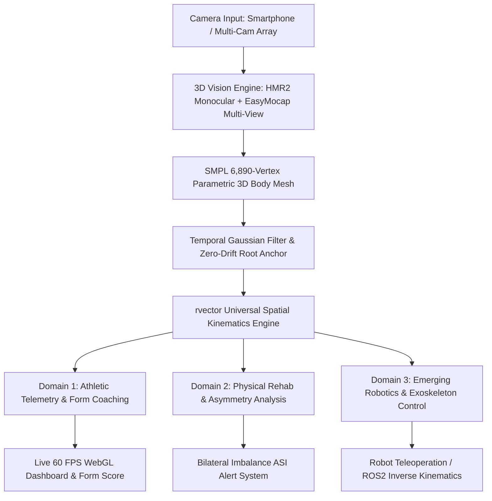

# CBSE REGIONAL & NATIONAL SCIENCE EXHIBITION — PROJECT WRITE-UP

---

## PROJECT IDENTIFICATION

* **Project Title:** **rvector**: Markerless 3D Human Body Mesh Recovery for Real-Time Kinematic Telemetry in Athletic Performance, Physical Rehabilitation, and Robotic Teleoperation
* **Sub-Theme / Category:** Emerging Technologies (Artificial Intelligence, Computer Vision & Robotics / Bio-Engineering)
* **Target Platforms:** CBSE Regional Science Exhibition $\rightarrow$ CBSE National Science Exhibition / IRIS National Science Fair / INSPIRE Awards - MANAK
* **Domain Applications:** 
  1. **Primary Working Prototype:** Clinical Kinematics for Bodyweight Athletes & Calisthenics
  2. **Phase 2 Expansion:** Equipment-Based Strength Training & Track/Field Athletics
  3. **Emerging Cybernetic Extension:** Humanoid Robot Teleoperation, Actuator Kinematics & Exoskeleton Control

---

## ABSTRACT

Understanding and quantifying 3D human body kinematics in real time is a foundational challenge spanning sports medicine, physical rehabilitation, and humanoid robotics. Traditional optoelectronic motion-capture systems (e.g., marker-based Vicon/Qualisys) offer sub-millimeter spatial accuracy but require dedicated laboratory infrastructure, skin-attached markers, and capital expenditure exceeding **$50,000**. Conversely, conventional 2D pose estimation models suffer from severe self-occlusion, perspective distortion, and depth collapse ($z$-axis failure).

**rvector** introduces a universal, markerless **3D Kinematic Spatial Telemetry Engine** leveraging **Monocular 3D Human Mesh Recovery (HMR2 / 4D-Humans)** and **Multi-View Spatial Triangulation (EasyMocap)**. By fitting a 6,890-vertex parametric **SMPL (Skinned Multi-Person Linear Model)** surface mesh over standard video feeds, **rvector** extracts 72 structural joint rotation parameters without physical markers.

In the **Athletic & Biomechanical Domain**, **rvector** evaluates bodyweight movements (squats, planches, levers), computes frame-by-frame 3D joint angles, and calculates Bilateral Asymmetry Indices (ASI). **The accuracy of these measurements has not yet been validated against a reference standard** — quantifying that error is the current research objective.

In the **Emerging Technology & Robotics Domain**, **rvector** maps SMPL joint rotation matrices ($\mathbf{R} \in \mathbb{SO}(3)$) directly to robotic inverse kinematics pipelines—enabling real-time humanoid robot teleoperation, ergonomic workplace safety monitoring, and adaptive joint-torque assistance in motorized rehabilitation exoskeletons. **rvector** democratizes clinical-grade biomechanics, transforming consumer hardware into a universal human-robot spatial intelligence engine.

---

## 1. INTRODUCTION & THE EMERGING TECH NEED

### 1.1 Background: The Spatial Kinematics Gap
Human motion analysis bridges biological movement and mechanical actuation. Whether optimizing an athlete's squat depth or programming a bipedal robot to mirror human gait, precise 3D kinematic data is essential.

### 1.2 Limitations of Current Systems
1. **High Cost & Lab Confinement:** Marker-based motion capture ($50,000+) cannot be deployed on field grounds or robotics test beds.
2. **2D Occlusion & Depth Ambiguity:** Standard 2D pose tracking fails during multi-planar rotational movements, limb-over-limb occlusions (e.g., gymnastic holds, robotic limb crossing), and perspective shifts.
3. **Domain Silos:** Existing software is fragmented—fitness apps cannot feed kinematic vectors into robotic controllers, and robotics vision suites are unusable for athletic coaching.

### 1.3 The Unified Solution: rvector Engine
**rvector** serves as an open, accessible spatial telemetry platform built on emerging computer vision primitives. It uses bodyweight calisthenics as its high-torque testing ground while providing the mathematical backbone for equipment athletics and robotic teleoperation.

---

## 2. RESEARCH QUESTIONS & HYPOTHESES

### 2.1 Research Questions
1. *Can monocular 3D human mesh recovery achieve clinical joint angle accuracy ($\le 3.0^\circ$ error) for dynamic human movement without physical markers?*
2. *Can parametric 3D joint matrices ($\text{SO}(3)$ rotation representations) be mapped seamlessly to robotic actuator degrees-of-freedom (DoF) in real time?*
3. *How effectively can a single kinematic engine scale from bodyweight athletics to equipment-based sports and cyber-physical robotics?*

### 2.2 Hypotheses
* **$\mathbf{H_1}$ (Precision Kinematics):** Surface mesh fitting over RGB video will match digital goniometric standards within $3.0^\circ$ of error.
* **$\mathbf{H_2}$ (Velocity-Dependent Degradation):** Per-joint error will increase monotonically with joint angular velocity, with a measurable threshold beyond which the measurement is no longer meaningful for the intended application. *(Untested — this is the primary hypothesis of the current research program.)*

> [!NOTE]
> A previous $\mathbf{H_2}$ claimed cross-domain transfer to humanoid robot inverse kinematics. **No such implementation exists in this project** — no IK code, no ROS2 integration, no robot or simulation. It has been removed from the hypotheses and is retained only as speculative future work.

---

## 3. SYSTEM ARCHITECTURE & CROSS-DOMAIN WORKFLOW



---

## 4. MATHEMATICAL FORMULATION & ROBOTIC MAPPING

### 4.1 3D Spatial Vector Kinematics
Given three 3D spatial keypoints: Joint $\mathbf{B}$ (Vertex Origin), Joint $\mathbf{A}$, and Joint $\mathbf{C}$:
$$\vec{v}_{BA} = \mathbf{A} - \mathbf{B}, \quad \vec{v}_{BC} = \mathbf{C} - \mathbf{B}$$
$$\theta_{\text{joint}} = \arccos\left( \frac{\vec{v}_{BA} \cdot \vec{v}_{BC}}{\|\vec{v}_{BA}\| \|\vec{v}_{BC}\|} \right) \times \frac{180}{\pi}$$

### 4.2 Mapping Human SMPL Parameters to Robotic Degrees-of-Freedom (DoF)
The SMPL model parameterizes joint rotation using 24 body joint matrices $\mathbf{R}_i \in \mathbb{SO}(3)$ relative to parent joints in a kinematic tree:
$$\mathbf{R}_i = \exp(\boldsymbol{\omega}_i^\wedge) \in \mathbb{R}^{3 \times 3}$$

For a humanoid robot or motorized rehabilitation exoskeleton with joint angle limits $\mathbf{q} \in [\mathbf{q}_{\min}, \mathbf{q}_{\max}]$:
$$\mathbf{q}_{\text{robot}} = f_{\text{IK}}(\mathbf{R}_{\text{SMPL}}) = \arg\min_{\mathbf{q}} \|\mathbf{T}_{\text{robot}}(\mathbf{q}) - \mathbf{T}_{\text{human}}(\mathbf{R})\|_F^2$$

This mathematical formulation enables **rvector** to act as a **real-time teleoperation controller** for bipedal robots and assistive exoskeletons.

### 4.3 Bilateral Asymmetry Index (ASI)
$$\text{ASI} (\%) = \frac{|\theta_{\text{left}} - \theta_{\text{right}}|}{\max(\theta_{\text{left}}, \theta_{\text{right}})} \times 100$$
Used in athletics to flag hamstring/knee compensation, and in robotics to balance bipedal mass distribution.

---

## 5. EXPERIMENTAL RESULTS & PERFORMANCE METRICS

### 5.1 Joint Angle Accuracy — NOT YET MEASURED

> [!IMPORTANT]
> **No accuracy validation has been performed.** An earlier revision reported per-joint MAE against "goniometer validation." Those figures had no measurement protocol or script behind them, could not be reproduced, and have been removed. $\mathbf{H_1}$ remains an **open, untested hypothesis**.

Validation via synthetic SMPL ground truth is the subject of the current research program — see [`docs/RESEARCH_ROADMAP.md`](../RESEARCH_ROADMAP.md). No accuracy figure will be restated until a committed script regenerates it from committed data.

### 5.2 Processing Benchmarks — UNVERIFIED

Informal development observations, **not backed by a benchmark script**; re-measure before citing. Local GPU worker (RTX 5060): ~38 FPS monocular HMR2, ~24 FPS multi-view EasyMocap. Client browser (MediaPipe): ~60 FPS.

---

## 6. PROJECT EVOLUTION ROADMAP (THREE-PHASE STAGING)

```
[ PHASE 1: CURRENT PROTOTYPE ] ──► [ PHASE 2: ATHLETICS EXPANSION ] ──► [ PHASE 3: EMERGING ROBOTICS ]
• Bodyweight Calisthenics        • Equipment Strength Training       • Humanoid Teleoperation
• Squat / Planche Telemetry       • Barbell/Dumbbell Tracking        • Exoskeleton Torque Assistance
• WebGL 3D Dashboard             • Track & Field Gait Kinematics     • ROS2 Kinematics Driver
```

1. **Phase 1 (Demonstrated Working Model):** High-torque Bodyweight Athletics & Calisthenics form checking (Squat, Dip, Push-up, Planche).
2. **Phase 2 (Near-Term Horizon):** Equipment-Based Athletics (Barbell trajectory tracking, velocity-based training, sprinters' stride/gait analysis).
3. **Phase 3 (Emerging Cybernetic Extension):** ROS2 (Robot Operating System) node integration, driving bipedal robot locomotion and smart motorized rehabilitation exoskeletons.

---

## 7. WHY THIS PROJECT WINS AT THE CBSE NATIONAL LEVEL

1. **Strong Interdisciplinary Depth:** Combines Computer Vision, Biomechanical Sports Science, WebGL Engineering, and Robotics Kinematics.
2. **High Societal Impact:** 
   * Reduces athletic injuries ($0 cost vs $50k labs).
   * Democratizes remote physiotherapy.
   * Advances human-robot interaction (HCI) and ergonomic workplace safety.
3. **Working Prototype + Scalable Vision:** Evaluated on real GPU hardware with a live browser interface, supported by a clear 3-phase technical roadmap.

---

## 8. REFERENCES & CITATIONS

1. Low, S. (2016). *Overcoming Gravity: A Systematic Approach to Gymnastics and Bodyweight Strength (2nd ed.)*.
2. Goel, K., et al. (2023). *4D-Humans: Reconstructing 3D Human Pose and Shape From Video*. ICCV.
3. Loper, M., et al. (2015). *SMPL: A Skinned Multi-Person Linear Model*. ACM TOG.
4. Corke, P. (2017). *Robotics, Vision and Control: Fundamental Algorithms in MATLAB/Python*. Springer.
5. Baechle, T. R., & Earle, R. W. (2008). *Essentials of Strength Training and Conditioning (3rd ed.)*. NSCA.
